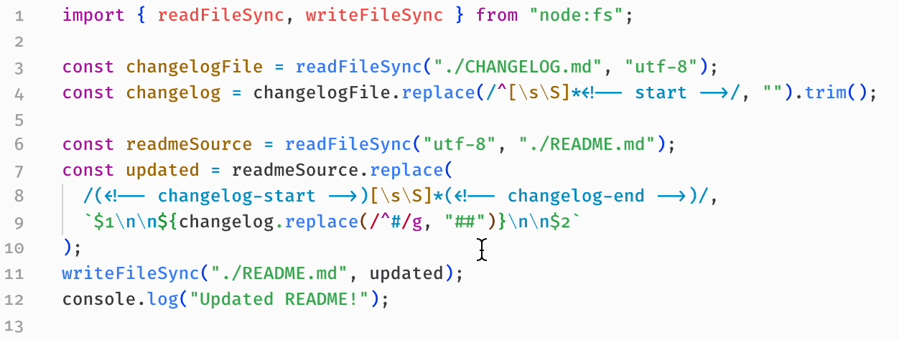

# Smart Transpose for VS Code

Are you bad at typing? Do you find yourself often getting two letters backwards? Then you may be familiar with macOS’s ⌃T shortcut, which makes it easy to swap two adjacent letters.

This extension is designed to augment that shortcut (to fix bigger mistakes!). For example, select a pair of words and press ⌃T. The two words will be swapped. Or select a pair of parameters to a function, then press ⌃T to swap them.

## Setup

Make sure you unbind the shortcut for “Transpose Letters” (`editor.action.transposeLetters`) and then map “Smart Transpose” (`transpose.smart`) to `ctrl+t`.

## Changelog

### v1.0.0

Initial release 🎉
